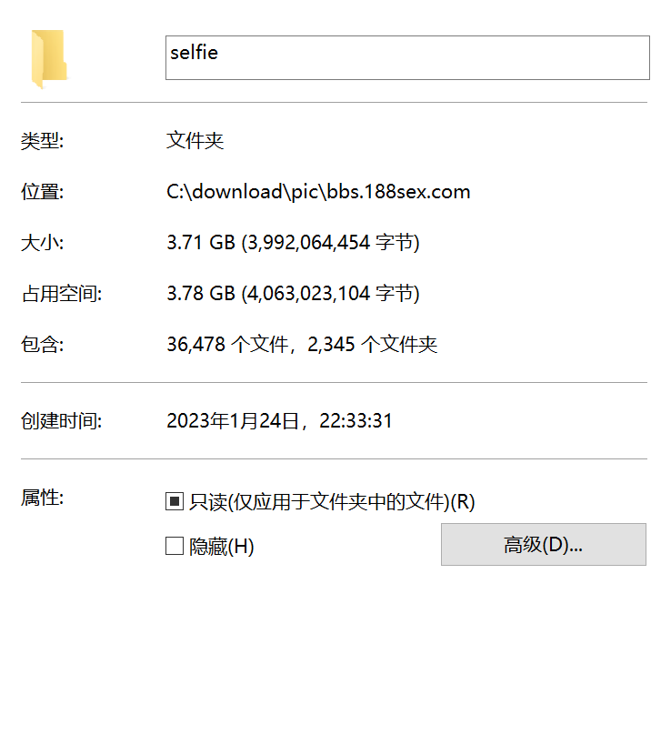

# MagnetSearcherPic
图片爬虫，爬取188sex，保存到本地

本项目基于[mzitu](https://github.com/chenjiandongx/mzitu) 

爬取网站 : https://bbs.188sex.com/forum-124-1.html
* 共有六个网址,这里仅展示其中之一举例

## 使用步骤
* 这里以爬取展示的网址为例
* 取消main函数中想要爬取的网址对应的函数,一个语句对应一个网址,具体见代码注释
* 修改dir_path = r"C:\download\pic\bbs.188sex.com\pure"对应的路径,并且确保该路径存在
* 然后就可以开始爬取了

```python
def get_pure_pic(page_num):
    """
    获取https://bbs.188sex.com/forum-124-1.html上的所有图片,1为page_num
    :param page_num:页面数
    :return: NA
    """

    url_part_1 = "https://bbs.188sex.com/forum-124-"
    dir_path = r"C:\download\pic\bbs.188sex.com\pure"

    search_url(url_part_1, page_num, dir_path)

    return

if __name__ == "__main__":
    sex_page_num_list = list(range(1, 408))
    selfie_page_num_list = list(range(1, 435))
    western_page_num_list = list(range(1, 438))
    fahrenheit_page_num_list = list(range(1, 201))
    pure_page_num_list = list(range(1, 146))
    art_page_num_list = list(range(1, 72))

    pool = Pool(processes=cpu_count())
    try:
        # delete_empty_dir(dir_path)
        # pool.map(get_selfie_pic, selfie_page_num_list)
        # pool.map(get_western_pic, western_page_num_list)
        pool.map(get_pure_pic, pure_page_num_list)
        # pool.map(get_sex_pic, sex_page_num_list)
        # pool.map(get_fahrenheit_pic, fahrenheit_page_num_list)
        # pool.map(get_art_pic, art_page_num_list)
    except Exception:
        time.sleep(30)
        # delete_empty_dir(dir_path)
        # pool.map(get_selfie_pic, selfie_page_num_list)
        # pool.map(get_western_pic, western_page_num_list)
        pool.map(get_pure_pic, pure_page_num_list)
        # pool.map(get_sex_pic, sex_page_num_list)
        # pool.map(get_fahrenheit_pic, fahrenheit_page_num_list)
        # pool.map(get_art_pic, art_page_num_list)
```

## 说明

* 避免把网站爬崩，使用sleep延缓爬取速度
* 仅用于学习测试
* 大概爬了两小时的成果，估算全站有30G以上

# MagnetSearcherPic
图片爬虫，爬取188sex，保存到本地

本项目基于[mzitu](https://github.com/chenjiandongx/mzitu) 

爬取网站 : https://bbs.188sex.com/forum-124-1.html
* 共有六个网址,这里仅展示其中之一举例

## 使用步骤
* 这里以爬取展示的网址为例
* 取消main函数中想要爬取的网址对应的函数,一个语句对应一个网址,具体见代码注释
* 修改dir_path = r"C:\download\pic\bbs.188sex.com\pure"对应的路径,并且确保该路径存在
* 然后就可以开始爬取了

```python
def get_pure_pic(page_num):
    """
    获取https://bbs.188sex.com/forum-124-1.html上的所有图片,1为page_num
    :param page_num:页面数
    :return: NA
    """

    url_part_1 = "https://bbs.188sex.com/forum-124-"
    dir_path = r"C:\download\pic\bbs.188sex.com\pure"

    search_url(url_part_1, page_num, dir_path)

    return

if __name__ == "__main__":
    sex_page_num_list = list(range(1, 408))
    selfie_page_num_list = list(range(1, 435))
    western_page_num_list = list(range(1, 438))
    fahrenheit_page_num_list = list(range(1, 201))
    pure_page_num_list = list(range(1, 146))
    art_page_num_list = list(range(1, 72))

    pool = Pool(processes=cpu_count())
    try:
        # delete_empty_dir(dir_path)
        # pool.map(get_selfie_pic, selfie_page_num_list)
        # pool.map(get_western_pic, western_page_num_list)
        pool.map(get_pure_pic, pure_page_num_list)
        # pool.map(get_sex_pic, sex_page_num_list)
        # pool.map(get_fahrenheit_pic, fahrenheit_page_num_list)
        # pool.map(get_art_pic, art_page_num_list)
    except Exception:
        time.sleep(30)
        # delete_empty_dir(dir_path)
        # pool.map(get_selfie_pic, selfie_page_num_list)
        # pool.map(get_western_pic, western_page_num_list)
        pool.map(get_pure_pic, pure_page_num_list)
        # pool.map(get_sex_pic, sex_page_num_list)
        # pool.map(get_fahrenheit_pic, fahrenheit_page_num_list)
        # pool.map(get_art_pic, art_page_num_list)
```

## 说明

* 避免把网站爬崩，使用sleep延缓爬取速度
* 仅用于学习测试
* 大概爬了两小时的成果，估算全站有30G以上


# MagnetSearcherPic
图片爬虫，爬取188sex，保存到本地

本项目基于[mzitu](https://github.com/chenjiandongx/mzitu) 

爬取网站 : https://bbs.188sex.com/forum-124-1.html
* 共有六个网址,这里仅展示其中之一举例

## 使用步骤
* 这里以爬取展示的网址为例
* 取消main函数中想要爬取的网址对应的函数,一个语句对应一个网址,具体见代码注释
* 修改dir_path = r"C:\download\pic\bbs.188sex.com\pure"对应的路径,并且确保该路径存在
* 然后就可以开始爬取了

```python
def get_pure_pic(page_num):
    """
    获取https://bbs.188sex.com/forum-124-1.html上的所有图片,1为page_num
    :param page_num:页面数
    :return: NA
    """

    url_part_1 = "https://bbs.188sex.com/forum-124-"
    dir_path = r"C:\download\pic\bbs.188sex.com\pure"

    search_url(url_part_1, page_num, dir_path)

    return

if __name__ == "__main__":
    sex_page_num_list = list(range(1, 408))
    selfie_page_num_list = list(range(1, 435))
    western_page_num_list = list(range(1, 438))
    fahrenheit_page_num_list = list(range(1, 201))
    pure_page_num_list = list(range(1, 146))
    art_page_num_list = list(range(1, 72))

    pool = Pool(processes=cpu_count())
    try:
        # delete_empty_dir(dir_path)
        # pool.map(get_selfie_pic, selfie_page_num_list)
        # pool.map(get_western_pic, western_page_num_list)
        pool.map(get_pure_pic, pure_page_num_list)
        # pool.map(get_sex_pic, sex_page_num_list)
        # pool.map(get_fahrenheit_pic, fahrenheit_page_num_list)
        # pool.map(get_art_pic, art_page_num_list)
    except Exception:
        time.sleep(30)
        # delete_empty_dir(dir_path)
        # pool.map(get_selfie_pic, selfie_page_num_list)
        # pool.map(get_western_pic, western_page_num_list)
        pool.map(get_pure_pic, pure_page_num_list)
        # pool.map(get_sex_pic, sex_page_num_list)
        # pool.map(get_fahrenheit_pic, fahrenheit_page_num_list)
        # pool.map(get_art_pic, art_page_num_list)
```

## 说明

* 避免把网站爬崩，使用sleep延缓爬取速度
* 仅用于学习测试
* 大概爬了两小时的成果，估算全站有30G以上

